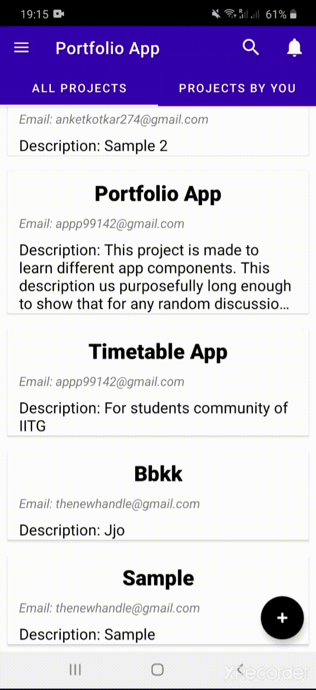
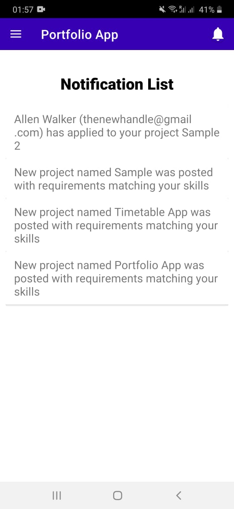
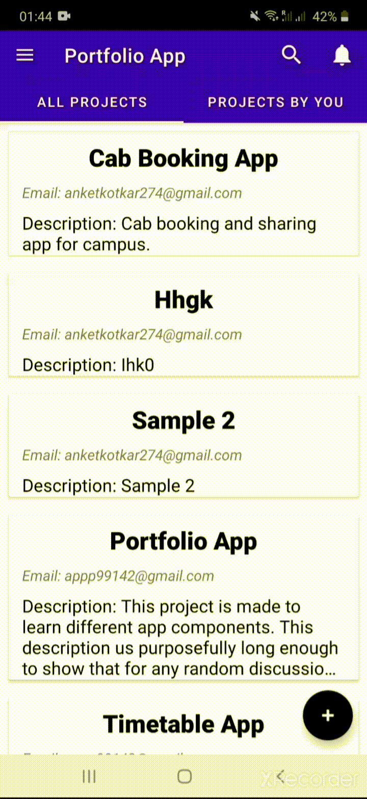

# Portfolio-App

Most times someone wants to gather a team for startup with specific requirments or clubs have specific projects, it would be better if there is common platform where all this can be posted. This is one such application. This project is developed using Java and Firebase.

## Features of App

New users can create a profile using Gmail ID and register their skills, ID card photo, and some other details. Already registered users can login to their Accounts. 

  

Registered users can visit their profile and can edit it.

Home page shows list of all projects posted by everyone for vacancies and list of all projects posted by the person. 

Every project has option show to apply for everyone other than the owner of the post. Owner can see the applicants list as well as edit post option. From the applicants list, owner can view the profile of applicant on clicking the applicant entry.

 

App also has an add project button on Home Page and a FAQ page. Along with this, whenver any project is posted, all users with required skills are notified about the project by an notification. Similarly project owner is notified whenver someone applies to the project posted by him. 

Navigation drawer can be used to navigate between different activities.

### Further Improvements To Be Done:
1. In app chatting
2. Option to add comments
3. Add filter option